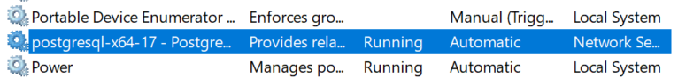
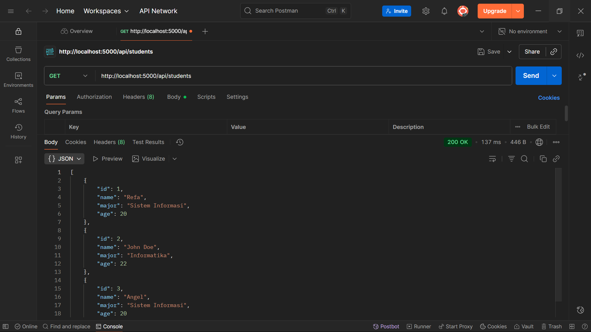
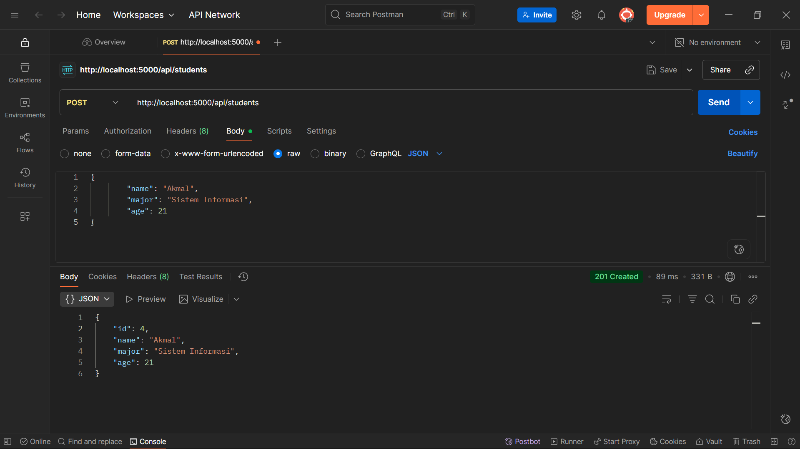
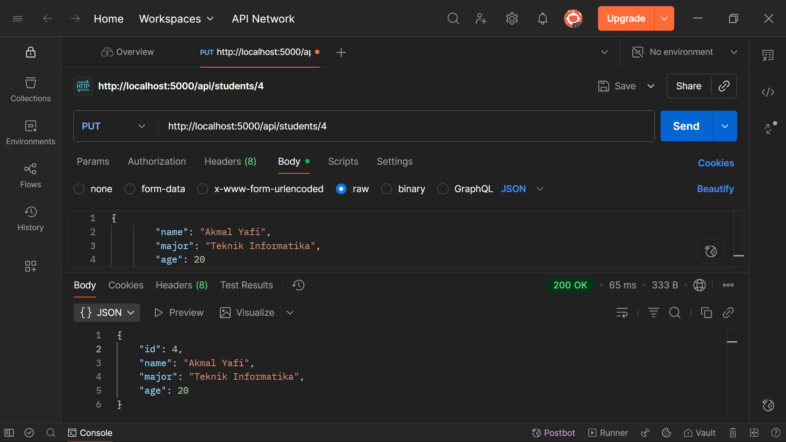
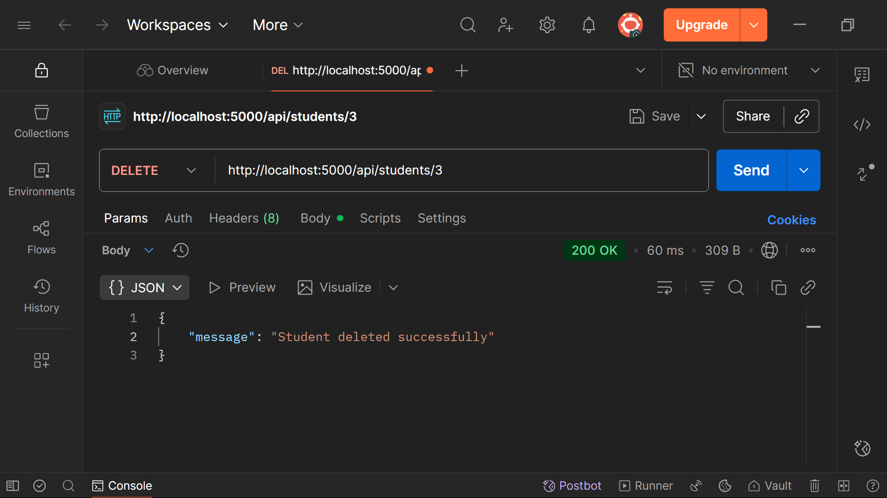
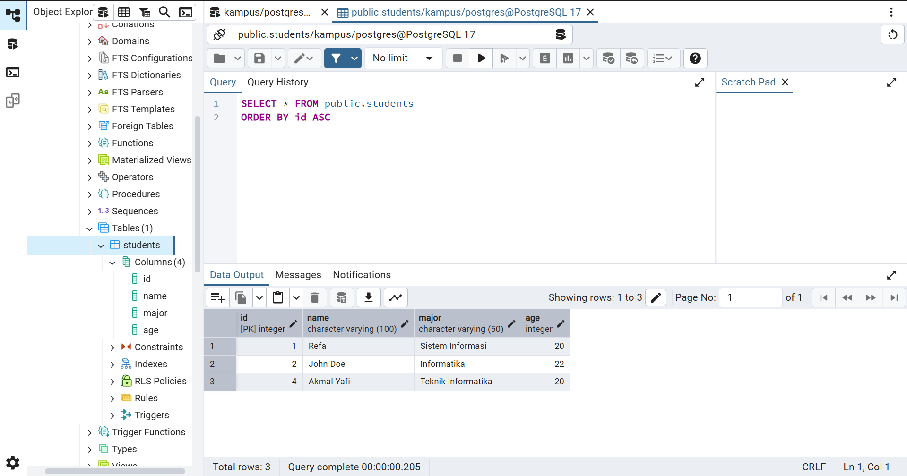

# RESTful API with Express & PostgreSQL
**Refa Setyagama Abdillah**
**WDUIUX Celerates - Mentor Imam Fadhilah**

## Preview Screenshots

### Server Running

### Postman Testing
**GET, Menampilkan semua data mahasiswa**

**GET, Menampilkan mahasiswa berdasarkan ID**

**POST, Menambahkan data mahasiswa baru**

**PUT, Memperbarui data mahasiswa**

**DELETE, Menghapus mahasiswa**

### PostgreSQL Table

