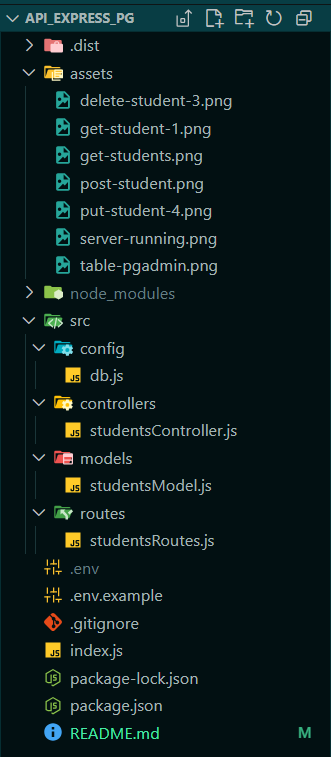
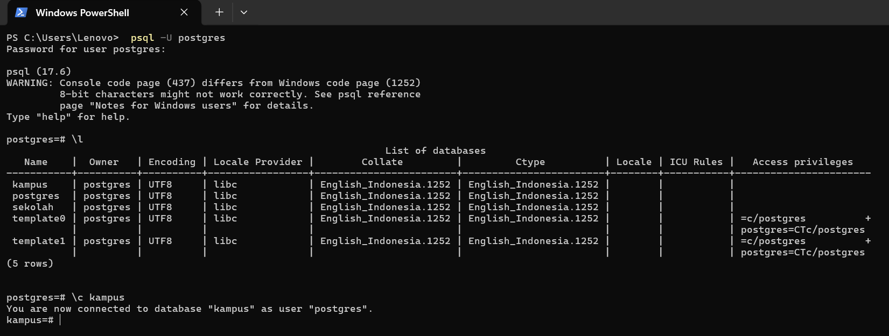

# RESTful API CRUD dengan PostgreSQL

Proyek ini adalah implementasi RESTful API sederhana untuk mengelola data mahasiswa (Students). API ini dibangun menggunakan Node.js, Express.js, dan terhubung ke database PostgreSQL.

- **Nama:** Refa Setyagama Abdillah
- **Program:** WDUIUX Celerates
- **Mentor:** Imam Fadhilah

## Deskripsi Proyek

API ini menyediakan fungsionalitas penuh untuk **CRUD (Create, Read, Update, Delete)** data mahasiswa. Proyek ini dibuat sebagai bagian dari pembelajaran backend untuk memahami konsep dasar arsitektur server, koneksi database, dan routing API.

## Teknologi yang Digunakan

- Node.js
- Express.js
- PostgreSQL
- Library `pg` untuk koneksi Node.js ke PostgreSQL
- `dotenv` untuk manajemen environment variables
- `cors` untuk mengelola Cross-Origin Resource Sharing

## Fitur

- **CREATE**: Menambahkan data mahasiswa baru ke dalam database.
- **READ**: Menampilkan semua data mahasiswa atau menampilkan data berdasarkan ID.
- **UPDATE**: Memperbarui data mahasiswa yang sudah ada berdasarkan ID.
- **DELETE**: Menghapus data mahasiswa dari database berdasarkan ID.

## Persiapan dan Instalasi

1.  **Clone Repository**
    ```bash
    git clone [https://github.com/username/repository-anda.git](https://github.com/username/repository-anda.git)
    cd repository-anda
    ```

2.  **Install Dependencies**
    ```bash
    npm install
    ```

3.  **Setup Database**
    Pastikan PostgreSQL server Anda sudah berjalan. Buat database baru bernama `kampus` dan jalankan query SQL berikut untuk membuat tabel `students`.
    ```sql
    CREATE TABLE students (
      id SERIAL PRIMARY KEY,
      name VARCHAR(100) NOT NULL,
      major VARCHAR(50),
      age INT
    );
    ```

4.  **Environment Variables**
    Buat file `.env` di root direktori proyek, lalu salin konten dari `.env.example` (jika ada) atau isi dengan format berikut. Sesuaikan dengan konfigurasi PostgreSQL Anda.
    ```env
    PORT=5000
    DB_USER=postgres
    DB_HOST=localhost
    DB_NAME=kampus
    DB_PASS=password_database_anda
    DB_PORT=5432
    ```

5.  **Jalankan Server**
    ```bash
    npm run dev
    ```
    Server akan berjalan di `http://localhost:5000`.
    
## Preview Screenshots

### Struktur File


### Server Running
saya menjalankan ini lewat "Run Windows + R" lalu saya ketik services.msc


### Koneksi Database
saya tes koneksi dengan membuka psql dan menjalankan perintah psql -U postgres, terdapat nama database yaitu "kampus". lalu saya tes apakah benar-benar terkoneksi.. saya jalankan perintah \c kampus (muncul keterangan You are now connected to database "kampus" as user "postgres"). artinya sudah terkoneksi


### Postman Testing
**GET, Menampilkan semua data mahasiswa** -
get api url http://localhost:5000/api/students, ini hasil setelah saya klik "send"


**GET, Menampilkan mahasiswa berdasarkan ID** -
get api url id http://localhost:5000/api/students/1, ini hasil setelah saya klik "send"


**POST, Menambahkan data mahasiswa baru** -
post api url id http://localhost:5000/api/students, ini hasil setelah saya klik "send"
 

**PUT, Memperbarui data mahasiswa** -
put api url id http://localhost:5000/api/students/4, ini hasil setelah saya klik "send"


**DELETE, Menghapus mahasiswa** -
delete api url id http://localhost:5000/api/students/3, ini hasil setelah saya klik "send"


### PostgreSQL Table -
ini adalah tabel pada tampilan pgAdmin 4. tabel ini berada di PostgreSQL/Databases/kampus/Schemas/public/Tables/students

