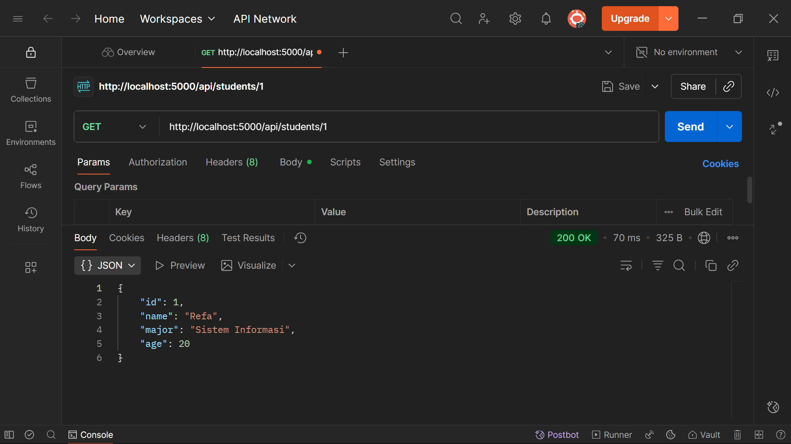

# RESTful API CRUD dengan PostgreSQL
**Refa Setyagama Abdillah**
**WDUIUX Celerates - Mentor Imam Fadhilah**

## Preview Screenshots

### Struktur File

### Server Running
saya menjalankan ini lewat "Run Windows + R" lalu saya ketik services.msc

### Koneksi Database
saya tes koneksi dengan membuka psql dan menjalankan perintah psql -U postgres, terdapat nama database yaitu "kampus". lalu saya tes apakah benar-benar terkoneksi.. saya jalankan perintah \c kampus (muncul keterangan You are now connected to database "kampus" as user "postgres"). artinya sudah terkoneksi

### Postman Testing
**GET, Menampilkan semua data mahasiswa**
get api url http://localhost:5000/api/students, ini hasil setelah saya klik "send"

**GET, Menampilkan mahasiswa berdasarkan ID**
get api url id http://localhost:5000/api/students/1, ini hasil setelah saya klik "send"

**POST, Menambahkan data mahasiswa baru**
post api url id http://localhost:5000/api/students, ini hasil setelah saya klik "send"

**PUT, Memperbarui data mahasiswa**
put api url id http://localhost:5000/api/students/4, ini hasil setelah saya klik "send"

**DELETE, Menghapus mahasiswa**
delete api url id http://localhost:5000/api/students/3, ini hasil setelah saya klik "send"

### PostgreSQL Table
ini adalah tabel pada tampilan pgAdmin 4. tabel ini berada di PostgreSQL/Databases/kampus/Schemas/public/Tables/students

